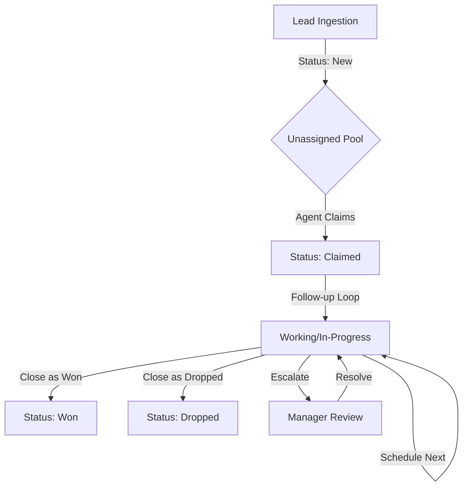

# CRM v2 System Design & Architecture

This document outlines the current state of the Trip With Nomads CRM (v2) lead lifecycle, specifically focusing on the Sales Agent workflow.

## 1. Current Sales Agent Workflow

The "Action Center" is designed to minimize friction for sales agents by providing all necessary tools in a single view.

### A. Lead Identification (Unassigned Queue)
- **Source**: Leads arrive via Website forms, Instagram, or manual entry.
- **Initial State**: `crm_status: "new"`, `allotted_to: null`.
- **Finding Leads**: Agents use the "Unassigned" filter tab in the Leads Table.

### B. Assignment (Claiming)
- **Action**: Agent clicks "Claim" on a new lead in the Side Sheet or Table menu.
- **Backend**: `assignLeadToAgent` action is triggered.
- **State Change**: `allotted_to` is set to the Agent's ID, status moves to `claimed`.

### C. Active Work (Follow-up Loop)
- **Engagement**: Agent initiates contact (WhatsApp/Call).
- **Logging**: Every interaction is logged as a "Note" with a specific type (`follow_up_1`, `whatsapp`, etc.).
- **Scheduling**: Agent sets `next_follow_up_at` directly from the profile header.
- **Transitions**: Lead moves through `follow_up_1` → `follow_up_4` → `final_call`.

### D. Closure (Terminal States)
- **Won**: Lead is successful. 
- **Dropped**: Lead is lost (requires a reason note).
- **Archived**: Lead is removed from active views.

---

## 2. System Flow Diagram

---

## 3. Gap Analysis & Proposed Improvements

While the current system is functional, several gaps exist that can be optimized for higher conversion rates.

| Gap | Severity | Impact | Proposed Solution |
| :--- | :--- | :--- | :--- |
| **Lead Stale Time** | High | Conversion | Manual claiming allows leads to sit unaddressed. Implement **Auto-Assignment (Round Robin)** for high-intent sources. |
| **Handover Friction** | Medium | Operations | "Won" leads require manual notification to finance. Implement **Automated Handoff Tasks** for Operations/Finance roles. |
| **Escalation Visibility** | Medium | Management | Escalations are currently just status changes. Add **Manager Alert Center** to surface flagged leads prominently. |
| **Pre-filled Messaging** | Low | Efficiency | Agents manually type initial outreach. Add **WhatsApp Message Templates** (deep-links) in the side sheet. |
| **Post-Drop Analysis** | Low | Strategy | No structured data on why leads drop. Implement **Required Drop Reasons** via a dropdown select. |

---

## 4. Technical Stack Highlights
- **Framework**: Next.js 15 (App Router).
- **UI Components**: Shadcn UI (Radix UI + Tailwind).
- **Database**: Supabase (PostgreSQL) with Realtime enabled.
- **Type Safety**: Domain-driven TypeScript interfaces for all Lead states.
